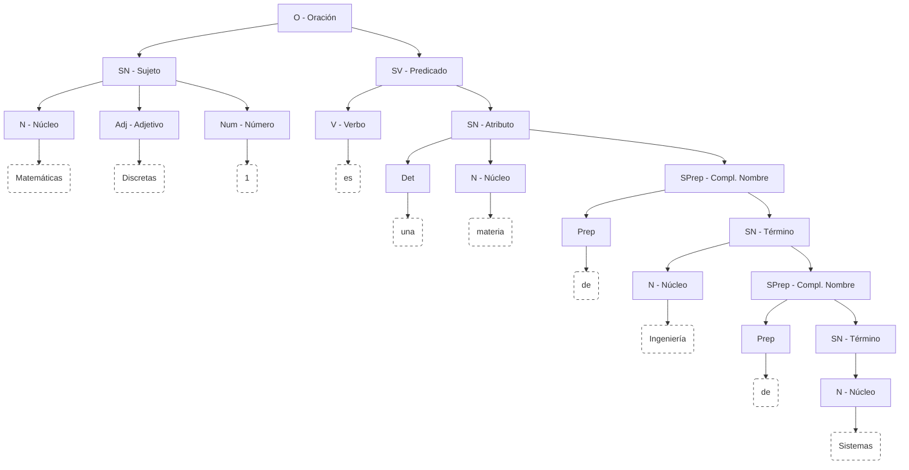

# Clase 01 - Fundamentos de Lógica Proposicional

{: .no_toc }

Esta sesión introduce el objeto de estudio de la Lógica Proposicional, diferenciando el lenguaje natural de las estructuras formales que rigen el razonamiento matemático.

## Tabla de Contenidos

{: .no_toc .text-delta }

1. TOC
{:toc}

---

## 1. El Lenguaje y la Necesidad de la Lógica

Cuando nos comunicamos, los seres humanos lo hacemos a traves del lenguaje. Gracias a este, los seres humanos podemos transmitir cualquier cosa como ideas, conceptos y sentimientos por medio de mensajes.

El intercambio de mensajes en el acto comunicativo tiene una intención (o propósito) y es de acuerto a esta que se estructura el mensaje. Por ejemplo, cuando alguien dice "Dino es el perro de los Mármol", el mensaje tiene la intención de informar o afirmar un hecho; sin embargo, cuando lo que se dice es ¿Dino es el perro de los Mármol? la intención busca preguntar o solicitar información.

Para construir mensaje empleamos oraciones. Una oración es la unidad minima provista de sentifo y sigunificado la cual, desde el punto de vista sintactico esta formada por la unión de un sujeto y un predicado:

La comunicación humana utiliza símbolos (alfabeto) para construir enunciados. Sin embargo, el **Lenguaje Natural (Español)** es inherentemente ambiguo (ej. ironía, contexto). La Lógica surge como la disciplina que busca la **exactitud** y la **eliminación de la ambigüedad**.

### Estructura del Lenguaje Natural

En gramática, la unidad mínima con sentido es la oración:

* **Sujeto:** Quien ejecuta la acción.
* **Predicado:** La acción (verbo) y su complemento.

> **Ejemplo:** *Dino es el perro de los Picapiedra*
>
> * **Sujeto**: Dino
> * **Predicado**: es el perro de los Picapiedra

### Clasificación de Enunciados

No todos los enunciados son aptos para el análisis lógico. Se clasifican según su intención comunicativa:

| Tipo | Intención Comunicativa | Ejemplo | Propiedad Lógica |
| :--- | :--- | :--- | :---: |
| **Declarativo** | Informar o afirmar un hecho. | "Pedro es el esposo de Vilma." | **Apto** |
| Interrogativo | Preguntar o solicitar información. | "¿Dino es el perro de los Mármol?" | No Apto |
| Imperativo | Ordenar o solicitar una acción. | "¡Estudia para el examen!" | No Apto |
| Exclamativo | Expresar emoción o sorpresa. | "¡Qué día tan caluroso!" | No Apto |

---

## 2. El Concepto Fundamental: La Proposición

La lógica se enfoca exclusivamente en los **Enunciados Declarativos** que cumplen una condición estricta.

### 2.1 Definición y Principio de Bivalencia

Una **Proposición Lógica** es todo enunciado declarativo al cual se le puede asignar, sin ambigüedad, un único **Valor de Verdad** (Axioma de Bivalencia).

> **Axioma de Bivalencia:** Un enunciado debe ser **Verdadero ($V$)** o **Falso ($F$)**, pero nunca ambos a la vez, ni ninguno.
{: .important }

### 2.2 Clasificación de Proposiciones

| Tipo | Descripción | Ejemplo |
| :--- | :--- | :--- |
| **Simple (Atómica)** | Es la unidad mínima. No tiene conectores lógicos internos. | $P$: "Hoy estudio Discretas 1." |
| **Compuesta (Molecular)** | Formada por dos o más proposiciones simples unidas por **Operadores Lógicos**. | $R$: "Hoy estudio Discretas 1 **y** hago deporte." |

---

## 3. Introducción a la Formalización

El objetivo de la lógica es transformar frases del lenguaje natural en **Expresiones Lógicas** mediante un proceso de traducción.

### 3.1 Los Operadores Lógicos (Conectores)

Los operadores son los símbolos que establecen la relación entre las proposiciones simples. Se presentan aquí de forma preliminar:

| Operador | Nombre | Símbolo | Lectura Común |
| :--- | :--- | :---: | :--- |
| **Negación** | No | $\neg$ | "No $P$" |
| **Conjunción** | Y | $\land$ | "$P$ y $Q$" |
| **Disyunción** | O Inclusiva | $\lor$ | "$P$ o $Q$" |
| **O exclusivo** | O exclusivo | $\oplus$ | "$P$ o $Q$" |
| **Condicional** | Si... entonces... | $\rightarrow$ | "Si $P$, entonces $Q$" |
| **Bicondicional** | Si y solo si | $\leftrightarrow$ | "$P$ si y solo si $Q$" |

### 3.2 Proceso de Traducción

Para formalizar una oración, se sigue este método de tres pasos:

1. **Identificar conectores lógicos** (ej. "o", "y", "si... entonces...").
2. **Identificar y asignar variables** a las proposiciones simples.
3. **Armar la expresión lógica** según la estructura gramatical.

---

## 4. Ejercicios Resueltos de Formalización

A continuación, se aplican los pasos de formalización a enunciados comunes:

#### Ejercicio 1: Disyunción

**Enunciado:** "Estudias o trabajas"

1. **Conector:** "o" ($\lor$).
2. **Variables:**
    * $P$: "Estudias"
    * $Q$: "Trabajas"
3. **Expresión Lógica:** $$P \lor Q$$

#### Ejercicio 2: Conjunción

**Enunciado:** "El Chapulín es un superhéroe y es Mexicano"

1. **Conector:** "y" ($\land$).
2. **Variables:**
    * $P$: "El Chapulín es un superhéroe"
    * $Q$: "El Chapulín es Mexicano"
3. **Expresión Lógica:** $$P \land Q$$

#### Ejercicio 3: Condicional (Implicación)

**Enunciado:** "Si estudias con juicio, ganarás la materia"

1. **Conector:** "Si... entonces..." ($\rightarrow$).
2. **Variables:**
    * $m$: "Estudias con juicio" (Antecedente)
    * $n$: "Ganarás la materia" (Consecuente)
3. **Expresión Lógica:** $$m \rightarrow n$$
