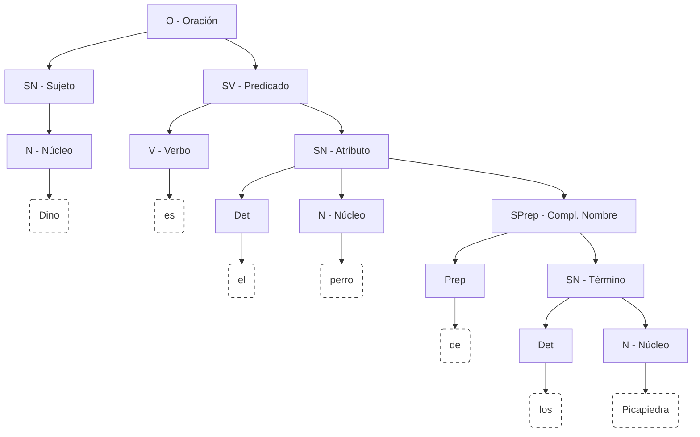
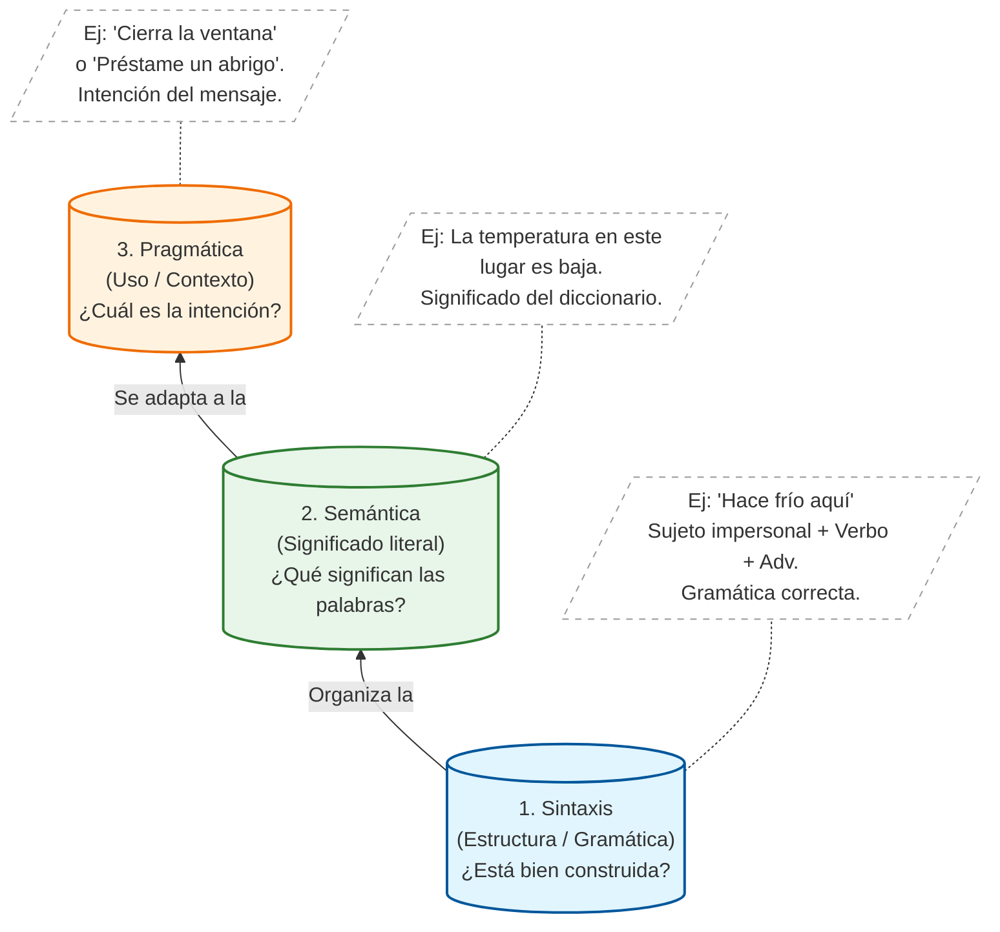

# Clase 01 - Fundamentos de Lógica Proposicional

{: .no_toc }

Esta sesión introduce el objeto de estudio de la Lógica Proposicional, diferenciando el lenguaje natural de las estructuras formales que rigen el razonamiento matemático.

## Tabla de Contenidos

{: .no_toc .text-delta }

1. TOC
{:toc}

---

## 1. El Lenguaje y su importancia

Cuando nos comunicamos, los seres humanos lo hacemos a **través** del lenguaje. Gracias a este, podemos transmitir cualquier idea, concepto o sentimiento por medio de mensajes.

Para construir mensajes empleamos oraciones. Una oración es la unidad **mínima** provista de significado y sentido. Desde el punto de vista **sintáctico**, está formada por la unión de un sujeto y un predicado (**Oración = Sujeto + Predicado**):

Al construir oraciones, se debe tener en cuenta un conjunto de reglas que establecen el orden y la forma en que se combinan las palabras; estas reglas se conocen como **sintaxis**. Comprenderla es esencial porque define el marco general que determina la validez de lo que intentamos expresar.

Además de la sintaxis, todo lo que decimos tiene un significado abordado por la **semántica**. Al escribir, relacionamos un concepto mental con una representación simbólica para que el mensaje sea interpretable por otros.

Por otro lado, el lenguaje posee un sentido práctico que depende del contexto; esto hace que lo dicho no sea siempre literal, sino que contenga significados "entre líneas". Esta dimensión es abordada por la **pragmática**.

A pesar de su riqueza, el lenguaje humano es inherentemente **ambiguo**; un mismo mensaje puede admitir múltiples interpretaciones, lo que suele derivar en confusiones. Asimismo, el objetivo de un enunciado puede transformarse según la intención comunicativa, incluso si las palabras son idénticas. Por ejemplo, mientras que la afirmación *"Dino es el perro de los Picapiedra"* cumple una función informativa, la variante *"¿Dino es el perro de los Picapiedra?"* busca solicitar información.

Históricamente, en la antigua Grecia, uno de los mayores usos del lenguaje consistía en la **persuasión** (influir o convencer a una audiencia). Para potenciar esta capacidad surge la **Retórica**, cuyo objetivo es utilizar el lenguaje como herramienta de convencimiento. Los maestros en esta rama eran los sofistas griegos; sin embargo, la retórica anteponía la **efectividad** sobre la **verdad**, explotando la **ambigüedad** propia del lenguaje.

Ante esta instrumentalización, Aristóteles buscó que el pensamiento humano tuviera reglas tan claras como las de las matemáticas. Para ello, **inventó la lógica**, cuyo propósito era formalizar el razonamiento para alcanzar la verdad de manera objetiva.

Teniendo en cuenta la intención comunicativa, la siguiente tabla clasifica los tipos de enunciados:

|Tipo |Intención Comunicativa |Ejemplo | 
|---|---|---|
|Declarativo | Informar o afirmar un hecho. | "Pedro es el esposo de Vilma." |
|Interrogativo | Preguntar o solicitar información. | "¿Dino es el perro de los Mármol?"|
|Imperativo	| Ordenar o solicitar una acción.|"¡Estudia para el examen!"|
|Exclamativo | Expresar emoción o sorpresa.| "¡Qué día tan caluroso!"|

De la tabla anterior, no todos los enunciados son aptos para determinar su veracidad. Por lo tanto, una primera restricción en pro de la exactitud consiste en limitar los enunciados válidos a los declarativos, conocidos como **proposiciones**. En las siguientes secciones se **ahondará** en estos enunciados y en la manera en que, tal como planteó Aristóteles, permiten establecer un sistema formal bajo reglas claras expresadas en lenguaje **matemático**.

---

## 2. El Concepto Fundamental: La Proposición

La lógica se enfoca exclusivamente en los **Enunciados Declarativos** que cumplen una condición estricta.

### 2.1 Definición y Principio de Bivalencia

Una **Proposición Lógica** es todo enunciado declarativo al cual se le puede asignar, sin ambigüedad, un único **Valor de Verdad** (Axioma de Bivalencia).

> **Axioma de Bivalencia:** Un enunciado debe ser **Verdadero ($V$)** o **Falso ($F$)**, pero nunca ambos a la vez, ni ninguno.
{: .important }

### 2.2 Clasificación de Proposiciones

| Tipo | Descripción | Ejemplo |
| :--- | :--- | :--- |
| **Simple (Atómica)** | Es la unidad mínima. No tiene conectores lógicos internos. | $P$: "Hoy estudio Discretas 1." |
| **Compuesta (Molecular)** | Formada por dos o más proposiciones simples unidas por **Operadores Lógicos**. | $R$: "Hoy estudio Discretas 1 **y** hago deporte." |

---

## 3. Introducción a la Formalización

El objetivo de la lógica es transformar frases del lenguaje natural en **Expresiones Lógicas** mediante un proceso de traducción.

### 3.1 Los Operadores Lógicos (Conectores)

Los operadores son los símbolos que establecen la relación entre las proposiciones simples. Se presentan aquí de forma preliminar:

| Operador | Nombre | Símbolo | Lectura Común |
| :--- | :--- | :---: | :--- |
| **Negación** | No | $\neg$ | "No $P$" |
| **Conjunción** | Y | $\land$ | "$P$ y $Q$" |
| **Disyunción** | O Inclusiva | $\lor$ | "$P$ o $Q$" |
| **O exclusivo** | O exclusivo | $\oplus$ | "$P$ o $Q$" |
| **Condicional** | Si... entonces... | $\rightarrow$ | "Si $P$, entonces $Q$" |
| **Bicondicional** | Si y solo si | $\leftrightarrow$ | "$P$ si y solo si $Q$" |

### 3.2 Proceso de Traducción

Para formalizar una oración, se sigue este método de tres pasos:

1. **Identificar conectores lógicos** (ej. "o", "y", "si... entonces...").
2. **Identificar y asignar variables** a las proposiciones simples.
3. **Armar la expresión lógica** según la estructura gramatical.

---

## 4. Ejercicios Resueltos de Formalización

A continuación, se aplican los pasos de formalización a enunciados comunes:

#### Ejercicio 1: Disyunción

**Enunciado:** "Estudias o trabajas"

1. **Conector:** "o" ($\lor$).
2. **Variables:**
    * $P$: "Estudias"
    * $Q$: "Trabajas"
3. **Expresión Lógica:** $$P \lor Q$$

#### Ejercicio 2: Conjunción

**Enunciado:** "El Chapulín es un superhéroe y es Mexicano"

1. **Conector:** "y" ($\land$).
2. **Variables:**
    * $P$: "El Chapulín es un superhéroe"
    * $Q$: "El Chapulín es Mexicano"
3. **Expresión Lógica:** $$P \land Q$$

#### Ejercicio 3: Condicional (Implicación)

**Enunciado:** "Si estudias con juicio, ganarás la materia"

1. **Conector:** "Si... entonces..." ($\rightarrow$).
2. **Variables:**
    * $m$: "Estudias con juicio" (Antecedente)
    * $n$: "Ganarás la materia" (Consecuente)
3. **Expresión Lógica:** $$m \rightarrow n$$
