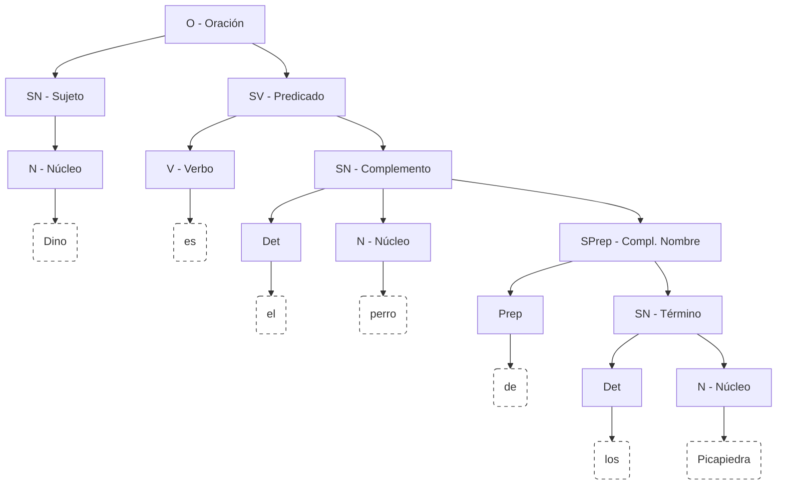
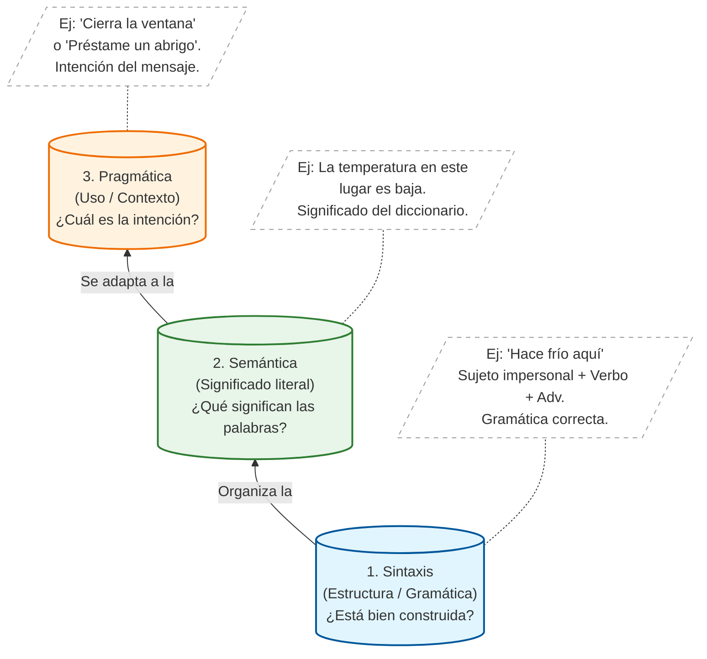
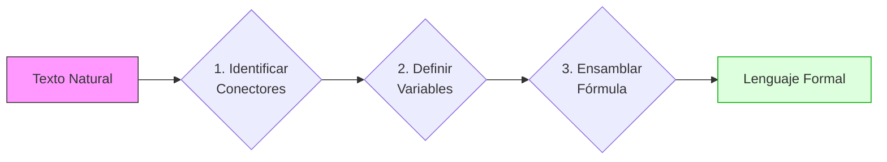

# Clase 01 - Fundamentos de Lógica Proposicional
{: .no_toc .text-delta }

Esta sesión introduce el objeto de estudio de la Lógica Proposicional, diferenciando el lenguaje natural de las estructuras formales que rigen el razonamiento matemático.

## Tabla de Contenidos
{: .no_toc .text-delta }

1. TOC
{:toc}

---

## El Lenguaje y su importancia

Cuando nos comunicamos, los seres humanos lo hacemos a **través** del lenguaje. Gracias a este, podemos transmitir cualquier idea, concepto o sentimiento por medio de mensajes.

Para construir mensajes empleamos oraciones. Una oración es la unidad **mínima** provista de significado y sentido. Desde el punto de vista **sintáctico**, está formada por la unión de un sujeto y un predicado (**Oración = Sujeto + Predicado**):

**Figura 1**. Analisis sintactico de una oracion.
{: .fs-2 .text-grey-dk-000 .d-block .mt-2 }

Al construir oraciones, se debe tener en cuenta un conjunto de reglas que establecen el orden y la forma en que se combinan las palabras; estas reglas se conocen como **sintaxis**. Comprenderla es esencial porque define el marco general que determina la validez de lo que intentamos expresar.

Además de la sintaxis, todo lo que decimos tiene un significado abordado por la **semántica**. Al escribir, relacionamos un concepto mental con una representación simbólica para que el mensaje sea interpretable por otros.

Por otro lado, el lenguaje posee un sentido práctico que depende del contexto; esto hace que lo dicho no sea siempre literal, sino que contenga significados "entre líneas". Esta dimensión es abordada por la **pragmática**.

**Figura 2**. Dimensiones sintactica, semántica y pragmática.
{: .fs-2 .text-grey-dk-000 .d-block .mt-2 }

A pesar de su riqueza, el lenguaje humano es inherentemente **ambiguo**; un mismo mensaje puede admitir múltiples interpretaciones, lo que suele derivar en confusiones. Asimismo, el objetivo de un enunciado puede transformarse según la intención comunicativa, incluso si las palabras son idénticas. Por ejemplo, mientras que la afirmación *"Dino es el perro de los Picapiedra"* cumple una función informativa, la variante *"¿Dino es el perro de los Picapiedra?"* busca solicitar información.

Históricamente, en la antigua Grecia, uno de los mayores usos del lenguaje consistía en la **persuasión** (influir o convencer a una audiencia). Para potenciar esta capacidad surge la **Retórica**, cuyo objetivo es utilizar el lenguaje como herramienta de convencimiento. Los maestros en esta rama eran los sofistas griegos; sin embargo, la retórica anteponía la **efectividad** sobre la **verdad**, explotando la **ambigüedad** propia del lenguaje.

Ante esta instrumentalización, Aristóteles buscó que el pensamiento humano tuviera reglas tan claras como las de las matemáticas. Para ello, **inventó la lógica**, cuyo propósito era formalizar el razonamiento para alcanzar la verdad de manera objetiva.

Teniendo en cuenta la intención comunicativa, la siguiente tabla clasifica los tipos de enunciados:

|Tipo |Intención Comunicativa |Ejemplo | 
|---|---|---|
|Declarativo | Informar o afirmar un hecho. | "Pedro es el esposo de Vilma." |
|Interrogativo | Preguntar o solicitar información. | "¿Dino es el perro de los Mármol?"|
|Imperativo	| Ordenar o solicitar una acción.|"¡Estudia para el examen!"|
|Exclamativo | Expresar emoción o sorpresa.| "¡Qué día tan caluroso!"|

**Tabla 1**. Algunos tipos de enunciados.
{: .fs-2 .text-grey-dk-000 .d-block .mt-2 }

De la tabla anterior, no todos los enunciados son aptos para determinar su veracidad. Por lo tanto, una primera restricción en pro de la exactitud consiste en limitar los enunciados válidos a los declarativos, conocidos como **proposiciones**. En las siguientes secciones se **ahondará** en estos enunciados y en la manera en que, tal como planteó Aristóteles, permiten establecer un sistema formal bajo reglas claras expresadas en lenguaje **matemático**.

---

## Conceptos Básicos de Lógica Proposicional

### Proposición

La lógica se enfoca exclusivamente en los **Enunciados Declarativos** yq que al ser oracines que afirman o niegan algo sobre la realidad pueden tener un valor de verdad asociado. En el campo de la logica, este tipo de enunciados se conocen como proposiciones.

  <strong style="color: #0056b3;">Definición: Proposición Lógica</strong>
  

    Una <b>Proposición Lógica</b> es todo enunciado declarativo al cual se le puede asignar, sin ambigüedad, un único <b>Valor de Verdad</b> (Axioma de Bivalencia).
  

  <strong style="color: #0056b3;">Definición: Axioma de Bivalencia</strong>
  

    El <b>Axioma de Bivalencia</b> establece que un enunciado puede ser <b>Verdadero ($V$)</b> o <b>Falso ($F$)</b>, pero nunca ambos a la vez.
  

### Clasificación de Proposiciones

Segun su estructura, existen dos tipos de proposiciones:
1. **Proposición simple o atómica**: No contiene conectores lógicos. 
   * **$P$**: "Hoy hay clase de Discretas 1".
   * **$Q$**: "7 es primo".
2. **Proposición compuesta o molecular**: Contiene conectores lógicos ($\neg$, $\land$, $\lor$, $\oplus$, $\rightarrow$, $\leftrightarrow).
   * **$\neg P$**: "Hoy no hay clase de Discretas 1".
   * **$P \land Q$**: "Hoy hay clase de Discretas 1 **y** 7 es primo".
   * **$P \rightarrow Q$**: **Si** hoy hay clase de Discretas 1, **entonces** 7 es primo.
   
---

## Introducción a la Formalización

En lógica, la **formalización** es el proceso de traducir enunciados y razonamientos del lenguaje natural (ambiguo y dependiente del contexto) a un lenguaje formal con:
* Símbolos definidos (variables y conectores).
* Reglas sintácticas (qué expresiones están bien formadas)
* Reglas semánticas (cómo asignarles valor de verdad)
* Reglas de inferencia (cómo derivar conclusiones válidas)

> El objetivo central de todo esto consiste en pasar de "frases" a estructuras que puedan ser evaluadas y manipuladas sin ambigüedad.
{: .important }

### Simbolos

En el lenguaje natural podemos decir lo mismo de muchas formas ("si... entonces...", "en caso de que...", "cuando...") y, además, una misma frase puede interpretarse de varias maneras según el contexto. Para evitar esa ambigüedad, la lógica trabaja con un **lenguaje formal**: un conjunto pequeño de **símbolos definidos** con significado fijo. 

#### Variables

Una **variable proposicional** representa una proposición completa (un enunciado declarativo con valor de verdad).
* **$P$**: "Hoy estudio Discretas 1."
* **$Q$**: "Mañana presento el parcial."

Estas letras **no son** números ni cantidades: son "etiquetas" para proposiciones.

#### Operadores Lógicos (Conectores)

Los **conectores** son símbolos que permiten construir proposiciones compuestas a partir de proposiciones simples.

| Operador | Nombre | Símbolo | Lectura Común |
| :--- | :--- | :---: | :--- |
| **Negación** | "No" | $\neg$ | "**No** $P$" |
| **Conjunción** | "Y" | $\land$ | "$P$ **y** $Q$" |
| **Disyunción** | "O" (Inclusiva) | $\lor$ | "$P$ **o** $Q$" |
| **O exclusivo** | "O... o..." (Pero no ambos) | $\oplus$ | "**O** $P$ **o** $Q$" |
| **Condicional** | "Si... entonces..." | $\rightarrow$ | "**Si** $P$, **entonces** $Q$" |
| **Bicondicional** | "Si y solo si" | $\leftrightarrow$ | "$P$ **si y solo si** $Q$" |

**Tabla 2**. Operadores lógicos.
{: .fs-2 .text-grey-dk-000 .d-block .mt-2 }

> **Nota clave:** en lógica, cada símbolo tiene una definición precisa que luego se formaliza con tablas de verdad.
{: .note }

### Proceso de Traducción

Para formalizar una oración del lenguaje natural se muestra el siguiente método consistente en **tres pasos**. La idea es pasar de una frase (potencialmente ambigua) a una **fórmula** con conectores bien definidos.

**Figura 3**. Flujo de trabajo para la traducción de enunciados.
{: .fs-2 .text-grey-dk-000 .d-block .mt-2 }

#### Paso 1. Detecte la estructura lógica (conectores)
1. Subraye las palabras que indiquen relación lógica:  
   **no**, **y**, **o**, **si… entonces…**, **si y solo si**, **a menos que**, **solo si**, etc.
2. Determine cuál es el **conector principal** (el que "manda" en toda la frase).
3. Si hay más de un conector, use **paréntesis** para reflejar la agrupación correcta.

#### Paso 2. Defina proposiciones simples asociandolas a variables
1. Separe la frase en **proposiciones atómicas** (enunciados declarativos sin conectores internos).
2. Asigne una letra a cada una (por ejemplo, $(P, Q, R)$) y escriba su significado.
3. Verifique que cada proposición atómica tenga **valor de verdad** (sea claramente verdadera o falsa).

#### Paso 3. Construya la fórmula y verifique
1. Sustituya cada proposición atómica por su variable.
2. Reemplace los conectores por sus símbolos:  
   $(\neg, \land, \lor, \oplus, \rightarrow, \leftrightarrow )$
3. Revise que la fórmula sea consistente con el español original:
   - ¿La negación está donde corresponde?
   - ¿Los paréntesis reflejan la intención?
   - ¿"solo si" se tradujo correctamente?

---

## Ejemplos resueltos

A continuación, se aplican los pasos de formalización a enunciados comunes:

### Ejemplo 1: Disyunción

**Enunciado**: 

"Estudias o trabajas"
{: .text-center }

1. **Conector principal**: "o" ($\lor$).
2. **Proposiciones atomicas**:
    * **$P$**: "Estudias"
    * **$Q$**: "Trabajas"
3. **Expresión Lógica:** 
   
   $$
   P \lor Q
   $$

### Ejemplo 2: Conjunción

**Enunciado**: 

"El Chapulín es un superhéroe y es Mexicano"
{: .text-center }

1. **Conector principal**: "y" ($\land$).
2. **Proposiciones atomicas**:
    * **$P$**: "El Chapulín es un superhéroe"
    * **$Q$**: "El Chapulín es Mexicano"
3. **Expresión Lógica**: 
   
   $$
   P \land Q
   $$

### Ejemplo 3: Condicional (Implicación)

**Enunciado**:

"Si estudias con juicio, ganarás la materia"
{: .text-center }

1. **Conector princioal:** "Si... entonces..." ($\rightarrow$).
2. **Proposiciones atómicas:**
    * **$m$**: "Estudias con juicio" (Antecedente)
    * **$n$**: "Ganarás la materia" (Consecuente)
3. **Expresión Lógica**:
   
   $$
   m \rightarrow n
   $$

### Ejemplo 4: Expresión compuesta

**Enunciado**:

"Si apruebo el examen y entrego el proyecto, entonces no tendré que ir a recuperación"
{: .text-center }

1. **Conector princioal:** "Si... entonces..." ($\rightarrow$).
2. **Proposiciones atómicas:**
    * **$p$**: "Apruebo el examen"
    * **$q$**: "Entrego el proyecto"
    * **$r$**: "Tendré que ir a recuperación"
3. **Expresión Lógica**:
   
   $$
   (p \land q) \rightarrow r
   $$