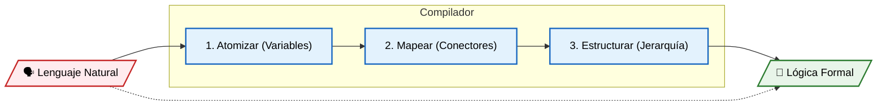
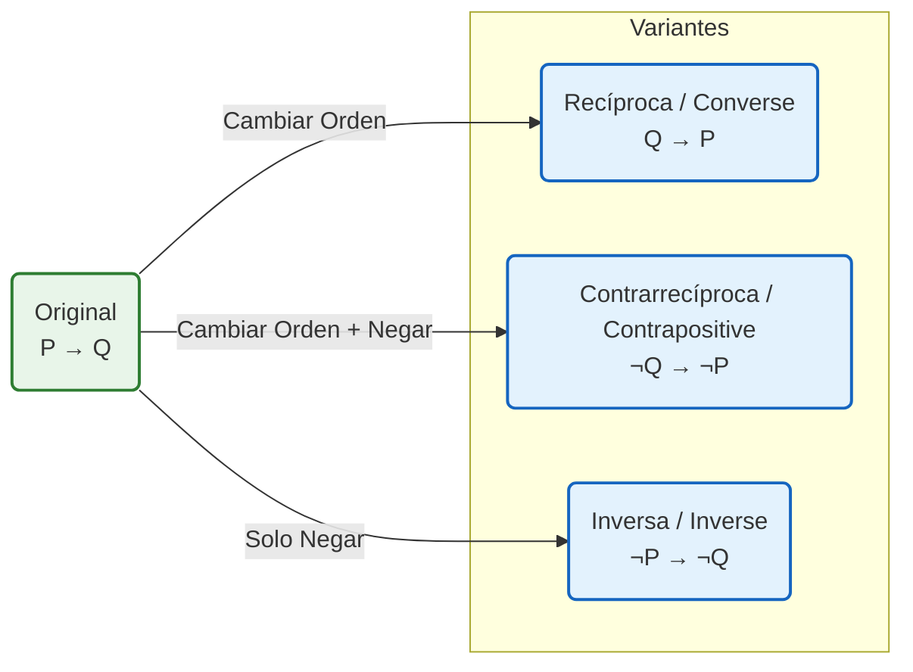

# Clase 03 - Equivalencias Lógicas y Álgebra de Proposiciones
{: .no_toc }

Teniendo en cuenta los conceptos iniciales vistos en las secciones anteriores, ya estamos listos para abordar con un poco mas de profundidad algunos aspectos relacionados con la traducción de lenguaje natural a expresiones logica proposicional. Una vez visto esto, vamos a tratar con un poco mas de profundidad aspectos relacionados con los conectores de implicación y equivalencia cuya comprensión es util para analizar relaciones de dependencia y equivalencia dentro de la logica formal.

## Tabla de Contenidos
{: .no_toc .text-delta }

1. TOC
{:toc}

---

## Repaso: El Kit del Traductor Lógico

Para lograr traducir correctamente del español (ambiguo) al lenguaje matemático (preciso), necesitamos tener a mano las herramientas que definimos en las clases 1 y 2.

Antes de comenzar, verifique que tiene claros estos tres componentes:

### 1. La Materia Prima: Proposiciones Atómicas

Recuerde el **Axioma de Bivalencia**: Solo nos interesan oraciones que puedan ser **Verdaderas (1)** o **Falsas (0)**.
* *En el código:* Estas serán nuestras variables booleanas (`p`, `q`, `r`, `isUserLoggedIn`).

### 2. El Pegamento: Operadores Lógicos

Estos símbolos son la estructura sintáctica que une las ideas.

<div style="text-align: center;" markdown="1">
| Nombre | Símbolo | Rol Gramatical (Aprox.) |
| :--- | :---: | :--- |
| Negación | $\neg$ | Modificador del verbo ("No") |
| Conjunción | $\land$ | Unión ("Y", "Pero") |
| Disyunción | $\lor$ | Alternativa ("O") |
| Condicional | $\to$ | Relación Causa-Efecto ("Si... entonces") |
| Bicondicional| $\leftrightarrow$ | Equivalencia ("Si y solo si") |

**Tabla 1**. Operadores lógicos fundamentales.
{: .fs-2 .text-grey-dk-000 .d-block .mt-2 }
</div>

### 3. Las Reglas de Puntuación: Jerarquía

Al igual que en la aritmética ($\times$ antes que $+$), en lógica el orden importa para evitar ambigüedades.
1.  **Paréntesis** $()$ (Máxima prioridad)
2.  **Negación** $\neg$
3.  **Conjunción** $\land$ y **Disyunción** $\lor$
4.  **Condicional** $\to$ y **Bicondicional** $\leftrightarrow$ (Menor prioridad)

---

## Traducción: De Palabras a Fórmulas (y Viceversa)

Traducir de lenguaje natural a lógico es similar a "compilar" código: buscamos eliminar la ambigüedad humana para dejar instrucciones precisas. Para realizar esto con éxito, seguiremos un proceso estructurado.

<div style="text-align: center;" markdown="1">


**Figura 1**. Resumen proceso de traducción.
{: .fs-2 .text-grey-dk-000 .d-block .mt-2 }
</div>

### Dirección 1: Lenguaje Natural $\to$ Lógica Formal

Para evitar errores comunes, recomendamos seguir un algoritmo de 3 pasos:

1.  **Atomización:** Identifique las oraciones simples y asígneles una variable ($P, Q, R...$).
2.  **Identificación de Conectores:** Busque las "palabras clave" y elija el símbolo correspondiente apoyándose en las siguientes tablas de referencia:
    
    <div markdown="1">
    | Tipo | Conector lógico | Forma simbólica | Enunciados en lenguaje natural |
    |---|---|---|---|
    | Conjuntivo | Conjunción | $P \land Q$ | • P y Q<br>• P, pero Q<br>• P aun Q<br>• P también Q<br>• P todavía Q<br>• P, aunque Q<br>• P sin embargo Q<br>• P además Q<br>• P no obstante Q |
    | Disyuntivo (inclusivo) | Disyunción | $P \lor Q$ | • P o Q<br>• P, a menos que Q<br>• Al menos una entre P y Q |
    | Disyuntivo exclusivo | Disyunción exclusiva | $P \oplus Q$ | • P o Q, pero no ambos<br>• O P o Q exclusivamente<br>• Exactamente uno de P y Q |
    
    **Tabla 2**. Operadores $\land$, $\lor$ y $\oplus$ y palabras claves relacionadas.
    {: .fs-2 .text-grey-dk-000 .d-block .mt-2 }
    </div>

    > **Notas clave**
    >
    >* El **"o"** en lenguaje natural se interpreta por defecto como **disyunción inclusiva**.
    >* El **"o exclusivo"** indica que **solo una** proposición es verdadera.
    >* Expresiones como *pero*, *sin embargo* o *no obstante* no alteran la estructura lógica (son conjunciones).
    >* La expresión *"a menos que"* se modela usualmente como una disyunción inclusiva ($P \lor Q$) o una implicación ($\neg Q \to P$).
    {: .note }

    El caso del condicional requiere especial atención. En la siguiente tabla, asuma que $P$ representa el **antecedente** y $Q$ el **consecuente**.
    
    <div markdown="1">
    | Tipo | Conector lógico | Forma simbólica | Enunciados en lenguaje natural |
    |---|---|---|---|
    | Condicional (Hipotético) | Implicación | $P \to Q$ | • Si $P$, entonces $Q$<br>• Si $P$, $Q$<br>• $Q$ si $P$<br>• $P$ solo si $Q$<br>• Para $P$, es necesario $Q$<br>• Es suficiente $P$ para $Q$<br>• $Q$ en caso de que $P$<br>• $Q$ siempre que $P$<br>• Como $P$, $Q$<br>• $Q$ cuando $P$<br>• $P$ implica que $Q$<br>• Cuando $P$, $Q$ |
    | Bicondicional | Bicondicional | $P \leftrightarrow Q$ | • $P$ si, y solo si, $Q$<br>• $P$ es suficiente y necesario para $Q$<br>• $P$ es equivalente a $Q$<br>• $P$ y $Q$ son equivalentes |
    
    **Tabla 3**. Operadores $\leftarrow$ y $\leftrightarrow$ y palabras claves relacionadas.
    {: .fs-2 .text-grey-dk-000 .d-block .mt-2 }
    </div>
    
    > **Notas clave sobre la Implicación**
    >
    > * La expresión **“$P$ solo si $Q$”** se formaliza como $P \to Q$. (El "solo si" introduce la condición necesaria/consecuente).
    > * La expresión **“$Q$ si $P$”** también corresponde a $P \to Q$. (El "si" introduce la condición suficiente/antecedente).
    > * En el **bicondicional**, ambas proposiciones tienen el mismo valor de verdad.
    {: .note }
    
3.  **Estructuración:** Use paréntesis para agrupar las ideas y definir la jerarquía.

**Ejemplo Guiado: Reglas de Red**

Analicemos el siguiente enunciado de política de seguridad para aplicar el algoritmo:

> "Puedes acceder a internet desde el campus **solo si** estudias ciencias de la computación **o** **no** eres estudiante de primer año."

* **Paso 1: Definir proposiciones atómicas (Variables)**
  * $P$: Puedes acceder a internet desde el campus.
  * $Q$: Estudias ciencias de la computación.
  * $R$: Eres estudiante de primer año.

* **Paso 2: Traducir Conectores**
  * "o" $\to \lor$ (Disyunción entre la carrera y el año).
  * "no" $\to \neg$ (Negación de ser de primer año: $\neg R$).
  * "solo si" $\to \to$ (Condicional).
      * **Atención:** Como vimos en la tabla anterior, "$P$ solo si..." indica que lo que sigue es el consecuente.

* **Paso 3: Formalizar**
  El antecedente es el acceso ($P$) y el consecuente es la condición compuesta ($Q$ o no $R$).

**Resultado Final**: A continuación se presenta la expresión lógica resultante:

$$
P \to (Q \lor \neg R)
$$

### Dirección 2: Lógica Formal $\to$ Lenguaje Natural

Esta habilidad es vital para leer código ajeno, documentación o especificaciones técnicas. El objetivo es convertir una fórmula abstracta en una oración coherente en español.

**Ejercicio:**
Dadas las proposiciones:
* $S$: El sistema tiene memoria disponible.
* $E$: Se ejecuta el proceso.

Interprete la fórmula: 

$$
\neg S \to \neg E
$$

* **Traducción Literal (Robótica):**
  
  > "Si no es cierto que el sistema tiene memoria disponible, entonces no es cierto que se ejecuta el proceso".

* **Traducción Natural (Profesional):**
  
  > "Si el sistema no tiene memoria, el proceso no se ejecuta".

> **Nota para programadores:** Esta estructura lógica es el fundamento de las *Cláusulas de Guardia* ([Guard Clauses](https://en.wikipedia.org/wiki/Guard_(computer_science))) en programación: verificar primero las condiciones de fallo para detener la ejecución antes de continuar.

## Ejemplos de traducción de lenguaje natural a lenguaje lógico

A continuación se muestran algunos ejemplos resueltos a modo de repaso con el fin de reforzar los conceptos claves de traducción.

> **Nota sobre la notación de variables (Estilo Matemático vs. Estilo Ingeniería)**
>
> Antes de resolver los ejercicios, tenga en cuenta que **no existe una única regla** para nombrar las proposiciones. Usted tiene libertad de elección según el contexto:
>
> * **Estilo Clásico ($P, Q, R$):** Es el estándar en los libros de matemáticas. Es ideal para analizar la estructura lógica sin distraerse con el contenido.
> * **Estilo Semántico ($Gasolina, Bateria, Edad$):** Es el estándar en Ciencias de la Computación y programación. Usar nombres descriptivos (como `isUserLoggedIn`) ayuda a no perder el significado de lo que estamos modelando.
>
> En los siguientes ejemplos alternaremos entre ambos estilos para que usted se familiarice con las dos formas de representación. Recuerde: el nombre de la variable no cambia la lógica.
{: .note }

Traducir de lenguaje natural a lenguaje lógico los siguientes enunciados:

1. "El automovil arranca si y solo si el tanque tiene gasolina y la bateria esta cargada".

   **Solución**:
   Como el enunciado tiene la forma "$P$ ***si y solo si*** $Q$" este es un bicondicional, por lo que se puede formalizar como $P \leftrightarrow Q$ en el cual:
   * $P$: El automovil arranca.
   * $Q$: El tanque tiene gasolina y la bateria esta cargada.

   Sin embargo, si analizados cada una de las proposiciones resultantes, podemos ver, que la proposición $Q$ tiene el conector ***"y"*** por lo que es una proposición compuesta. A continuación, se muestra el analisis de cada proposición teniendo en cuenta lo previamente mencionado y nombrando las proposiciones simples empleando el estilo semantico (ver nota anterior):
   * Para $P$ tenemos la siguiente proposición simple:
     * $ON$: El automovil arranca.
   * Para $Q$ tenemos las siguiente proposiciones simples unidas mediante la conjunción ($\land$):
     * $GAS$: El tanque tiene gasolina.
     * $CHARGED$: La bateria esta cargada.

   De modo que $P \equiv ON$ y $Q \equiv (GAS \land CHARGED)$. Por lo que $P \leftrightarrow Q$ se puede formalizar como:

   $$
   ON \leftrightarrow (GAS \land CHARGED)
   $$

2. "Saldras a jugar solo si terminas la tarea".

   **Solución**:
   El enunciado es un condicional, por lo que se puede formalizar como $J \to T$.

   Donde:
   * $J$: Saldras a jugar.
   * $T$: Terminas la tarea.

   Por lo que el enunciado se puede formalizar como:

   $$
   J \to T
   $$

3. "Si no estudio Matematicas Discretas 1 y no hago la tarea de Logica y Representación 1, entonces no podre cursar Matematicas Discretas 2 ni Logica y Representación 2".

   **Solución**:
   El enunciado es una proposicion condicional de la forma $P \to Q$, donde el antecedente y el consecuente son proposiciones compuestas tal y como se muestra a continuación:
   * $P$: No estudio Matematicas Discretas 1 y no hago la tarea de Logica y Representación 1.
   * $Q$: No podre cursar Matematicas Discretas 2 ni Logica y Representación 2.

   En lo que respecta al antecedente $P$, tenemos las siguientes proposiciones simples:
   * $M1$: Estudio Matematicas Discretas 1.
   * $T$: Hago la tarea de Logica y Representación 1.

   Estas proposiciones estan negadas y unidas por una conjunción ($\land$). Por lo que:

   $$
   P \equiv \neg M1 \land \neg T
   $$

   Por otro lado, en lo que respecta al consecuente $Q$, tenemos las siguientes proposiciones simples:
   * $M2$: Podré cursar Matematicas Discretas 2.
   * $T2$: Podré cursar Logica y Representación 2.

   Estas proposiciones estan negadas y unidas por una conjunción ($\land$). Por lo que:

   $$
   Q \equiv \neg M2 \land \neg T2
   $$

   Finalmente el enunciado se puede formalizar como:

   $$P \to Q \equiv (\neg M1 \land \neg T) \to (\neg M2 \land \neg T2)$$

4. "No puedes subir la montaña rusa si mides menos de 1.2, a menos que tengas mas de 16 años".

   **Solución**:
   Antes de empezar la traducción tratemos de entender el enunciado llevandolo a una forma que diga lo mismo pero que sea mas facil de traducir: "Si mides menos de 1.2 y no tienes mas de 16 años, entonces no puedes subir a la montaña rusa".

   Este enunciado es mas facil de traducir ya que facilmente se puede indentificar que es una proposicion condicional de la forma $P \to Q$ donde el antecedente y el consecuente son:
   * $P$: Mides menos de 1.2 y no tienes mas de 16 años.
   * $Q$: No puedes subir a la montaña rusa.

   Sin embargo, las proposiciones anteriores son compuestas de modo que el siguiente paso consiste obtener las proposiciones simples que las componen.

   En lo que respecta al antecedente $P$, tenemos las siguientes proposiciones simples:
   * $Age$: Tienes mas de 16 años.
   * $Height$: Mides menos de 1.2.

   De modo que el antecedente $P$ es $P \equiv Height \land \neg Age$.

   Por otro lado, el consecuente $Q$ se puede expresar en terminos de una unica proposicion simple:
   * $RollerCoaster$: Puedes subir a la montaña rusa.

   Por lo que $Q = \neg RollerCoaster$.

   Finalmente el enunciado se puede formalizar como:

   $$P \to Q = (Height \land \neg Age) \to \neg RollerCoaster$$

---

## Expresiones Condicionales y sus Variantes

Como ya sabemos, los enunciados de la forma "Si $P$ entonces $Q$" están relacionados con el operador condicional $P \to Q$.

Este operador es único porque **el orden importa** (no es conmutativo). Además, sus componentes reciben nombres específicos que denotan su jerarquía:
* **$P$ (Antecedente):** También llamado hipótesis o premisa.
* **$Q$ (Consecuente):** También llamado tesis o conclusión.

Esta relación de dependencia se rige por la siguiente tabla de verdad:

<div style="text-align: center;" markdown="1">
| $P$ | $Q$ | $P \to Q$ |
| :---: | :---: | :---: |
| V | V | **V** |
| V | F | **F** |
| F | V | **V** |
| F | F | **V** |

**Tabla 4**. Tabla de verdad del condicional.
{: .fs-2 .text-grey-dk-000 .d-block .mt-2 }
</div>

### Entendiendo la Lógica del Condicional (La Promesa)

A menudo es difícil entender por qué el condicional es verdadero cuando el antecedente es falso (filas 3 y 4). La mejor forma de verlo es como una **promesa** o un **contrato** o como una relación de **causa efecto**. 

Supongamos la promesa de campaña de un político:
> "Si **soy elegido** ($P$), entonces **les daré casa a todos** ($Q$)."

Analicemos si el político dijo la verdad o mintió en cada escenario:

<div style="text-align: center;" markdown="1">
| Escenario ($P$) | Resultado ($Q$) | Juicio al Político ($P \to Q$) | Explicación |
| :--- | :--- | :---: | :--- |
| **Gana** (V) | **Da casas** (V) | **V** | Cumplió su promesa. |
| **Gana** (V) | **<u>No</u> da casas** (F) | **F** | **Mentiroso.** Rompió el contrato. |
| **Pierde** (F) | **Da casas** (V) | **V** | No estaba obligado, pero lo hizo. No mintió. |
| **Pierde** (F) | **<u>No</u> da casas** (F) | **V** | No ganó, así que la promesa no aplica. No mintió. |

**Tabla 5**. Análisis semántico de la implicación.
{: .fs-2 .text-grey-dk-000 .d-block .mt-2 }
</div>

> **Conclusión:**
> El condicional $P \to Q$ solo es **FALSO** en un único caso: cuando la hipótesis se cumple ($P$ es V) pero la conclusión falla ($Q$ es F). En todos los demás casos, el "contrato" se mantiene válido.
{: .note }

### Definición de Variantes

A partir de una proposición original $P \to Q$, podemos derivar otras tres formas lógicas cambiando el orden y aplicando operaciones de negación tal y como se resume en la siguiente figura:

<div style="text-align: center;" markdown="1">


**Figura 3**. Relación entre las variantes del condicional.
{: .fs-2 .text-grey-dk-000 .d-block .mt-2 }
</div>

Supongamos la proposición: 
> "Si **es un cuadrado** ($P$), entonces **tiene cuatro lados** ($Q$)".

Si se aplican las operaciones sobre los miembros de la proposición original del ejemplo anterior, obtenemos los resultados que se resumen en la siguiente tabla:

<div style="text-align: center;" markdown="1">

| Nombre | Fórmula | En Lenguaje Natural | Estatus Lógico |
| :--- | :---: | :--- | :--- |
| **Original** | $P \to Q$ | "Si es cuadrado, tiene 4 lados" | **Verdadera** |
| **Recíproca** | $Q \to P$ | "Si tiene 4 lados, es un cuadrado" | **Falsa** (Podría ser un rectángulo) |
| **Inversa** | $\neg P \to \neg Q$ | "Si no es cuadrado, no tiene 4 lados" | **Falsa** (Idem) |
| **Contrarrecíproca** | $\neg Q \to \neg P$ | "Si no tiene 4 lados, no es un cuadrado" | **Verdadera** |

**Tabla 6**. Variantes del condicional.
{: .fs-2 .text-grey-dk-000 .d-block .mt-2 }
</div>

> **Observación Clave:**
> Note que la proposición **Original** y la **Contrarrecíproca** comparten el mismo valor de verdad. Lo mismo ocurre entre la **Recíproca** y la **Inversa**.
{: .note }

Entender las variaciones de la expresión es vital para la [programación defensiva](https://es.wikipedia.org/wiki/Programaci%C3%B3n_defensiva) y la argumentación lógica. A veces, expresar una condición de una manera equivalente (usando la contrarrecíproca) puede hacer que la resolución de un problema o la escritura de código sea mucho más fácil y legible.

### Demostración de Equivalencia

Para probar matemáticamente que una implicación es idéntica a su contrarrecíproca, usamos una tabla de verdad comparativa. Busque las columnas con valores idénticos:

| $P$ | $Q$ | $P \to Q$ (Original) | $\neg Q$ | $\neg P$ | $\neg Q \to \neg P$ (Contra.) | $Q \to P$ (Recíproca) |
|:---:|:---:|:---:|:---:|:---:|:---:|:---:|
| V | V | **V** | F | F | **V** | V |
| V | F | **F** | V | F | **F** | V |
| F | V | **V** | F | V | **V** | F |
| F | F | **V** | V | V | **V** | V |

**Conclusión:**
1.  La columna de la **Original** y la **Contrarrecíproca** son idénticas en todas las filas. Por lo tanto, son **Lógicamente Equivalentes**.
    $$P \to Q \equiv \neg Q \to \neg P$$
2.  La **Recíproca** tiene valores distintos. Asumir que $P \to Q$ es igual a $Q \to P$ es un error lógico conocido como *Falacia de Afirmación del Consecuente*.

### Aplicación en Ciencias de la Computación

La contrarrecíproca es la base del [**Refactoring**](https://en.wikipedia.org/wiki/Code_refactoring) de condiciones para reducir la anidación (Indentation Hell).

**Código Original ($P \to Q$):**
"Si el usuario es válido, ejecutamos el proceso".

```python
if user_is_valid:
    execute_process()
```

**Refactorización usando Contrarrecíproca ($\neg Q \to \neg P$)**:
"Si no vamos a ejecutar el proceso (porque falló algo), es porque el usuario no es válido". En código, esto se traduce en **Cláusulas de Guarda** (Guard Clauses): manejamos la negación primero para salir temprano.

```python
if not user_is_valid:
    return  # Salimos temprano (Return Early)
execute_process() # Flujo principal sin anidación
```

## Condiciones de suficiencia y necesidad ("La letra pequeña de las Matematicas")

Imaginemos que estamos redactando un contrato legal o las especificaciones para la prestación de un servicio. En el lenguaje cotidiano, solemos ser imprecisos. Decimos "Si llueve, me mojo", pero olvidamos que puedo mojarme sin que llueva (si me caigo a una piscina).

En matemáticas discretas, y en la vida profesional (derecho, programación, ingeniería), confundir lo que es necesario con lo que es suficiente puede llevar a pérdidas de dinero, bugs en el código o demandas legales.

Vamos a analizarlo con un **Contrato de prestación de servicios**.

### Escenario del Contrato

Imaginemos un contrato entre un desarrollador (Proveedor) y una empresa (Cliente). Vamos a analizar cómo una mala redacción de las condiciones necesarias y suficientes puede afectar el pago o la ejecución del trabajo. Supongamos que el contrato tiene las siguientes clausulas:
* **Clausula 1**: "*Si el servidor se cae por más de 1 hora consecutiva, el Proveedor deberá descontar el 10% de la factura mensual*."
* **Clausula 2**: "*El Proveedor recibirá el pago final, solo si entrega el código fuente documentado*."

Para realizar un analisis del contrato, vamos a emplear realizar la traducción de las clausulas anteriormente dadas en lenguaje natural, a lenguaje formal:

|Clausula| Lenguaje natural | Proposiciones simples | Expresión logica|
|---- | ---- | ---- | ---- |
|1|"*Si el servidor se cae por más de 1 hora consecutiva, el Proveedor deberá descontar el 10% de la factura mensual*."|• **$serverDown$**, "*El servidor se cae por más de 1 hora consecutiva*"<br>• **$discount$**: "*El Proveedor deberá descontar el 10% de la factura mensual*" |$serverDown \to discount$|
|2|"*El Proveedor recibirá el pago final, solo si entrega el código fuente documentado*"|• **$payment$**, "*El Proveedor recibirá el pago final*"<br> : **$documented$**"*Entrega el código fuente documentado*"|$payment \to documented$|


{: .warning }
> **La Trampa del "Solo Si"**: ***No confíe en su intuición cronológica.***
>
> Cuando se traduce la frase "$P$ **solo si** $Q$" a lenguaje formal, es comun cometer el error de escribirla como $Q \rightarrow P$ porque $Q$ suele ser un requisito previo en el tiempo.
>
> En lógica formal, la expresión "solo si" **siempre introduce la Condición Necesaria** (la punta de la flecha).
>
> * **Forma incorrecta:** $Q \rightarrow P$
> * **Forma correcta:** $P \rightarrow Q$ 
>
> **Regla de oro:** El "solo si" actúa como un candado en la puerta de salida. Si tienes $P$, *obligatoriamente* tuviste que tener $Q$.

### Definiciones formales

Retomemos la definición forma de la implicación condicional:

$$
P \to Q
$$

#### Condicion de suficiencia (La Garantía)

En una implicación $P \to Q$, decimos que **$P$ es suficiente para $Q$** porque **cada vez que $P$ ocurre, $Q$ queda garantizada**. En términos de valores de verdad: si $P$ es verdadera, entonces $Q$ también debe ser verdadera.

**Analisis lógico**: Retomemos la clausula 1:

$$
serverDown \to discount
$$

* **¿Es suficiente?** <u>Sí</u>. Basta con que el servidor falle 1 hora para que el descuento sea obligatorio. No importa si fue por un ataque hacker o un error de código; si ocurre $serverDown$, $discount$ es inevitable.
* **¿Es la única forma?** <u>No necesariamente</u>. Podría haber otras cláusulas que también generen descuentos (por ejemplo, demora en la entrega), por lo tanto, la caída del servidor no es la única causa posible de un descuento, pero es suficiente para causarlo.

#### Condicion de necesidad (el requisito obligatorio)

En una implicación $P \to Q$, decimos que **$Q$ es necesaria para $P$** porque **$P$ no puede ocurrir sin $Q$**.  Tener $Q$ no garantiza $P$, pero **sin $Q$, $P$ es imposible**.

**Analisis lógico**: Ahora analicemos la clausula 2:

$$
payment \to documented
$$

{: .tip }
> Para analizar cláusulas "**solo si**", suele ser útil usar el **contrarrecíproco**:
> $$\neg Q \to \neg P$$
> Por ejemplo, de $payment \to documented$ se deduce $\neg documented \to \neg payment$.

* **¿Es suficiente entregar el código?** <u>No</u>. Pues se puede entregar el código ($documented$) y aun así no recibir el pago ($payment$) porque quizás este no funciona o fue entregado tarde. Entregar el código no garantiza el pago.
* **¿Es necesario?** <u>Sí</u>. Si el código no se entrega ($\neg documented$), es imposible que recibir el pago ($\neg payment$), pues este es un prerrequisito.


### Resumen: Suficiencia vs. Necesidad

La siguiente tabla resume lo anteriormente tratado:

| Característica | **Condición Suficiente** ($P$) | **Condición Necesaria** ($Q$) |
| :--- | :--- | :--- |
| **Rol en $P \to Q$** | Es el **Antecedente** (La Causa).<br>*(Está a la izquierda de la flecha)* | Es el **Consecuente** (El Requisito).<br>*(Está a la derecha de la flecha)* |
| **Definición** | Es un disparador. Si ocurre, el resultado es automático. | Es un bloqueo. Si falta, el resultado es imposible. |
| **Frases Clave** | *"Si...", "Basta con que...", "Es suficiente para..."* | *"Solo si...", "Es necesario que...", "Únicamente si..."* |
| **Ejemplo Clásico** | **El Fuego**<br>(Si ves fuego, *garantizas* que hay oxígeno). | **El Oxígeno**<br>(Es un *requisito*. Sin oxígeno no hay fuego). |
| **Analogía Visual** | **El Círculo Pequeño** (Subconjunto).<br>Estar en Madrid es suficiente para estar en España. | **El Círculo Grande** (Superconjunto).<br>Estar en España es necesario para estar en Madrid. |
| **La Prueba de Fuego**<br>*(Pregúntate esto)* | *"¿Si tengo esto, el resultado está asegurado?"* | *"¿Si NO tengo esto, el resultado se vuelve imposible?"* |

### Tabla de Referencia: Traducción de Conectores Lógicos

La estructura base es la implicación: **$Antecedente \rightarrow Consecuente$**

| **INDICADORES DE SUFICIENCIA** | **INDICADORES DE NECESIDAD** |
| :--- | :--- |
| **(Lo que sigue a esto es el Antecedente $P$)** | **(Lo que sigue a esto es el Consecuente $Q$)** |
| *Van al lado IZQUIERDO de la flecha ($P \rightarrow$)* | *Van al lado DERECHO de la flecha ($\rightarrow O$)* |
| **Si**... (*Si $P$, entonces $Q$*) | ...**solo si**... |
| **Cuando**... | ...**solamente si**... |
| **Cada vez que**... | ...**únicamente si**... |
| **Dondequiera que**... | ...**es una condición necesaria** para... |
| **Siempre que**... | ...**es un requisito** para... |
| **Basta que**... | ...**es indispensable** para... |
| **Es suficiente que**... | ...**implica**... |
| **En caso de que**... | ...**conlleva**... |
| **Dado que**... | ...**requiere**... |
| **Todo** / **Cualquier**... | ...**es obligatorio** para... |
| **Quien**... | |

**Cómo usar esta tabla (Ejemplos prácticos)**

Para usar la tabla, busque el conector en la frase original y **"etiquete"** la parte de la oración que va justo después de él.

| Lenguaje Natural | Análisis (Antecedente / Consecuente) | Énfasis del Conector | Expresión Lógica |
| :--- | :--- | :--- | :--- |
| **"Basta que** firmes el documento para que sea válido." | **Ant ($P$):** Firmas el documento<br><br>**Cons ($Q$):** El documento es válido | **Suficiencia**<br>*(El énfasis está en la causa)* | $$Firmas \rightarrow Válido$$ |
| "El coche arranca **solo si** tiene gasolina." | **Ant ($P$):** El coche arranca<br><br>**Cons ($Q$):** Tiene gasolina | **Necesidad**<br>*(El énfasis está en el requisito)* | $$Arranca \rightarrow Gasolina$$ |
| "Ser humano **implica** ser mortal." | **Ant ($P$):** **Ser humano**<br><br>**Cons ($Q$):** Ser mortal | **Suficiencia**<br>*(Basta ser humano)* | $$Humano \rightarrow Mortal$$ |

---

## El Bicondicional: La Doble Vía

Finalmente, llegamos al operador más estricto: el **Bicondicional** ($\leftrightarrow$). En lenguaje natural lo leemos como **"si y solo si"** (o abreviado *sii* en matemáticas, *iff* en inglés).

### Definición Lógica
El bicondicional ocurre cuando una proposición es **condición necesaria y suficiente** para la otra. Es decir, es una calle de doble sentido:

$$P \leftrightarrow Q \equiv (P \to Q) \land (Q \to P)$$

### Tabla de Verdad
A diferencia del condicional, aquí el orden no importa (es conmutativo). El bicondicional es **Verdadero** únicamente cuando ambas proposiciones tienen el **mismo valor de verdad** (ambas V o ambas F).

| $P$ | $Q$ | $P \leftrightarrow Q$ | Análisis |
| :---: | :---: | :---: | :--- |
| V | V | **V** | Coinciden (Equivalentes) |
| V | F | **F** | Discrepan |
| F | V | **F** | Discrepan |
| F | F | **V** | Coinciden (Equivalentes) |

> **Analogía para Programadores:**
> El bicondicional funciona exactamente igual que el operador de igualdad estricta (`==`) o la compuerta lógica **XNOR** (Exclusive NOR). Devuelve `true` si los inputs son idénticos.
{: .note }

### Ejemplo Práctico: Especificación de Software

> "El sistema activa la alarma ($A$) **si y solo si** detecta movimiento ($M$)".
> $$A \leftrightarrow M$$

Esto implica dos garantías fuertes:
1.  **Si hay movimiento $\to$ Suena alarma** (Suficiencia).
2.  **Si suena alarma $\to$ Hubo movimiento** (Necesidad: no hay falsos positivos).

Si fuera solo un condicional simple ($M \to A$), la alarma podría sonar por error (un bug) y la proposición seguiría siendo cierta. El bicondicional prohíbe eso.

---

## Resumen de la Clase

Hoy hemos profesionalizado nuestra capacidad de traducción y análisis. Llévese estas 3 reglas de oro:

1.  **Algoritmo de Traducción:** Atomizar $\to$ Detectar Conectores $\to$ Estructurar.
2.  **Ojo con el "Solo si":** Recuerde siempre que introduce el consecuente ($P \to Q$).
3.  **Contrarrecíproca:** Si necesita refactorizar código o demostrar algo, úsela. Es su mejor amiga equivalente ($\neg Q \to \neg P$).

