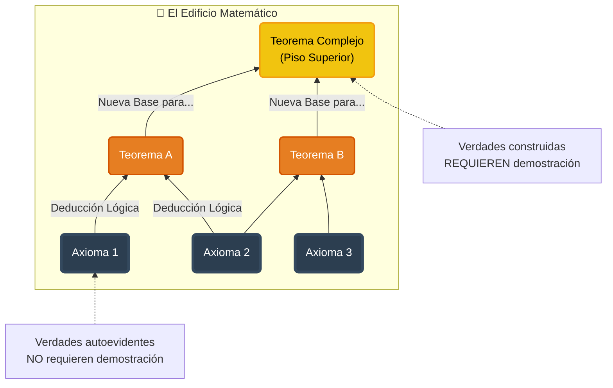

# Clase 04 – Enfoque axiomático
{: .no_toc }

## Introducción: Del Álgebra Escolar a la Lógica Formal
{: .no_toc }

Seguramente, durante sus estudios de Álgebra en el colegio se topó con ejercicios de **simplificación** como el siguiente:

> **Ejercicio:** Simplificar la expresión racional:
>
> $$\frac{x^2-9}{x^2+4x+3}$$

Para resolverlo, usted no probaba números al azar hasta que funcionara. Usted aplicaba reglas estructurales (casos de factorización):

$$
\begin{aligned}
  \frac{x^2-9}{x^2+4x+3} &= \frac{(x-3)(x+3)}{(x+3)(x+1)} & \quad \text{(Diferencia de cuadrados y Trinomio)} \\
                         &= \frac{x-3}{x+1} & \quad \text{(Cancelación de términos semejantes)}
\end{aligned}
$$

**Nótese algo crucial:** Mediante la aplicación de reglas que asumimos como verdaderas (teoremas matemáticos), transformamos una expresión compleja en una **equivalente más simple** sin necesidad de evaluar el valor de $x$.

En la **Lógica Proposicional**, el juego es el mismo, solo cambian las fichas:
* Ya no operamos con variables numéricas reales ($x, y, \pi$), sino con variables proposicionales ($p, q, r$).
* Nuestras operaciones no son suma y resta, sino conjunciones ($\land$), disyunciones ($\lor$) e implicaciones ($\to$).

### ¿Por qué necesitamos un nuevo enfoque?
{: .no_toc }

En la clase anterior utilizamos **Tablas de Verdad** (Enfoque basado en Modelos) para verificar equivalencias. Si bien este método es infalible, se vuelve inmanejable rápidamente: una tabla con 5 variables requiere 32 filas; una con 10 variables, ¡1024 filas!

Aquí entra el **Enfoque Axiomático**. Al igual que en el álgebra, utilizaremos un conjunto de "Leyes" o "Axiomas Lógicos" para manipular, simplificar y demostrar equivalencias de forma elegante y eficiente, sin necesidad de construir tablas gigantescas.

## Objetivos de la Clase
{: .no_toc }

En esta sesión:
1.  Repasaremos brevemente la diferencia entre el enfoque semántico (tablas) y el sintáctico (axiomas).
2.  Presentaremos las **Leyes de la Lógica** (sus nuevas "reglas de factorización").
3.  Realizaremos ejercicios de **simplificación** paso a paso.
4.  Aprenderemos a validar argumentos lógicos mediante derivación formal.

## Tabla de Contenidos
{: .no_toc .text-delta }

1. TOC
{:toc}

---

## Repaso: Equivalencia Lógica y el Enfoque Basado en Modelos

Antes de comenzar a operar con axiomas, es fundamental tener claro qué estamos buscando. En la **Clase 03**, definimos el concepto central de nuestra álgebra: la **Equivalencia Lógica**.

### ¿Qué significa que dos proposiciones sean equivalentes?

Dos proposiciones compuestas $P$ y $Q$ son lógicamente equivalentes (se denota $P \equiv Q$ o $P \iff Q$) si tienen **exactamente el mismo valor de verdad** para todas las posibles combinaciones de verdad de sus variables atómicas.

En términos sencillos: semánticamente, $P$ y $Q$ dicen lo mismo, aunque su estructura gramatical (sintaxis) sea diferente.

### El Enfoque Basado en Modelos (Tablas de Verdad)

Hasta ahora, nuestra herramienta principal para verificar si dos expresiones eran equivalentes ha sido el **Enfoque basado en Modelos**. Este método consiste en construir una tabla de verdad exhaustiva ("fuerza bruta") para inspeccionar cada escenario posible.

**Ejemplo de la clase anterior:**
Recordemos cómo demostramos que negar una condicional *no* implica negar sus partes, sino afirmar el antecedente y negar el consecuente:

$$\neg(p \to q) \equiv p \land \neg q$$

Construyendo la tabla de verdad (el modelo):

| $p$ | $q$ | $p \to q$ | $\mathbf{\neg(p \to q)}$ | $\neg q$ | $\mathbf{p \land \neg q}$ | ¿Iguales? |
|:---:|:---:|:---:|:---:|:---:|:---:|:---:|
| 1 | 1 | 1 | **0** | 0 | **0** | ✅ |
| 1 | 0 | 0 | **1** | 1 | **1** | ✅ |
| 0 | 1 | 1 | **0** | 0 | **0** | ✅ |
| 0 | 0 | 1 | **0** | 1 | **0** | ✅ |

Al observar que la columna de $\neg(p \to q)$ es idéntica a la de $p \land \neg q$ en todas las filas, concluimos que la equivalencia es válida.

> **El problema de este enfoque:**
> Como mencionamos en la introducción, este método es perfecto para verificar, pero ineficiente para *descubrir* o simplificar. Si nos piden simplificar una expresión de 4 variables, ¿realmente queremos dibujar una tabla de 16 filas?
>
> Para evitar esto, cambiamos de estrategia: del **enfoque semántico** (tablas) al **enfoque sintáctico** (axiomas).

## El Enfoque Axiomático: La Narrativa de la Verdad

Cuando se lleva a cabo un procedimiento matemático, existe un cierto parecido con el acto de contar una historia. En ambos casos se persigue un objetivo y, para alcanzarlo, se emplea un conjunto de herramientas propias de cada campo que permiten encadenar una serie de pasos con el fin de llegar a una conclusión coherente.

En matemáticas, la forma en que se “cuentan” estas historias y, en gran medida, la manera en que se construye el conocimiento, reside en las **demostraciones**, las cuales se desarrollan siguiendo un **enfoque axiomático**.

### La Herencia de Euclides

Viajando en el tiempo, alrededor del año 300 a. C., la obra **"Los Elementos"** de Euclides dio origen a este enfoque al presentar gran parte de la geometría griega de la época mediante una secuencia lógica cuidadosamente estructurada.

Para ello, Euclides partía de un conjunto de premisas que se asumían como verdaderas —y que, por tanto, no requerían demostración— conocidas como **axiomas**. A partir de estos, y mediante deducciones lógicas, se llegaba a nuevas conclusiones denominadas **teoremas**.

> **La Metáfora del Edificio**
> Un sistema axiomático puede entenderse como un rascacielos: sus cimientos son los **axiomas** fundamentales. Sobre ellos se van construyendo sucesivos niveles formados por **teoremas**, los cuales, a su vez, se convierten en el piso base para nuevas deducciones. De este modo, cada nuevo resultado se apoya necesariamente en resultados previos, garantizando la solidez de la estructura.

### Aplicación a la Lógica Proposicional

De manera análoga, en la **lógica proposicional** partimos de un conjunto de axiomas que interpretamos como **Leyes Lógicas**.

Estas leyes funcionan como un **conjunto explícito de reglas** que nos indican qué transformaciones están permitidas. Son equivalencias que asumimos como válidas y que podemos aplicar sin necesidad de volver a demostrarlas en cada ocasión. Gracias a ellas, podremos deducir nuevos resultados, establecer equivalencias y simplificar expresiones de forma sistemática.

A partir de este punto, el trabajo en esta clase consistirá en **partir de una expresión inicial y transformarla paso a paso**, justificando cada cambio mediante la aplicación de una ley lógica. Así, una demostración no será más que una **secuencia ordenada de transformaciones equivalentes**, análoga a los procedimientos de simplificación que ya conocemos del álgebra.

---

## Inventario de Axiomas del Álgebra de Proposiciones

A continuación se presenta el inventario de leyes que utilizaremos en el curso. Estas constituirán sus herramientas fundamentales para razonar de forma deductiva y simplificar expresiones sin recurrir al uso de tablas de verdad.

> **Nota Importante sobre la Bibliografía**
>
> Es posible que al consultar textos guía (como *Rosen*, *Epp* o *Velleman*) encuentre listas de leyes ligeramente diferentes. Algunos autores prefieren listas minimalistas (pocos axiomas) y dejan muchas reglas como ejercicios para el estudiante, mientras que otros ofrecen listas más extensas para facilitar el cálculo.
>
> **Para efectos de evaluación y ejercicios en este curso, esta tabla será nuestra "fuente de verdad".** Le recomendamos utilizar explícitamente estas formas para justificar sus pasos en los talleres y exámenes.

Para facilitar su uso, hemos organizado las leyes en tres grupos funcionales:

### Grupo 1: Leyes de Estructura (Álgebra Booleana)
Estas leyes definen cómo interactúan los operadores básicos $\land$ y $\lor$. Funcionan de manera muy similar a las reglas aritméticas de la suma y la multiplicación que usted ya conoce.

| Nombre de la Ley | Forma $\land$ (Conjunción) | Forma $\lor$ (Disyunción) |
| :--- | :--- | :--- |
| **Identidad** | $p \land V \equiv p$ | $p \lor F \equiv p$ |
| **Dominación** | $p \land F \equiv F$ | $p \lor V \equiv V$ |
| **Idempotencia** | $p \land p \equiv p$ | $p \lor p \equiv p$ |
| **Conmutativa** | $p \land q \equiv q \land p$ | $p \lor q \equiv q \lor p$ |
| **Asociativa** | $(p \land q) \land r \equiv p \land (q \land r)$ | $(p \lor q) \lor r \equiv p \lor (q \lor r)$ |
| **Distributiva** | $p \lor (q \land r) \equiv (p \lor q) \land (p \lor r)$ | $p \land (q \lor r) \equiv (p \land q) \lor (p \land r)$ |
| **Absorción** | $p \lor (p \land q) \equiv p$ | $p \land (p \lor q) \equiv p$ |

> **Tips:**
> La **Ley Distributiva** y la de **Absorción** suelen confundirse, pero son opuestas:
> * Use la **Distributiva** para "expandir" o romper paréntesis.
> * Use la **Absorción** para "reducir" drásticamente una expresión cuando una variable se repite dentro y fuera del paréntesis.

### Grupo 2: Leyes de la Negación
Estas leyes son fundamentales para manipular el operador "No" ($\neg$), permitiéndonos moverlo dentro o fuera de los paréntesis y eliminar dobles negaciones.

| Nombre de la Ley | Expresión | Descripción |
| :--- | :--- | :--- |
| **Doble Negación** | $\neg(\neg p) \equiv p$ | Negar dos veces equivale a afirmar. |
| **De Morgan (AND)** | $\neg(p \land q) \equiv \neg p \lor \neg q$ | La negación de una "Y" es una "O" de negaciones. |
| **De Morgan (OR)** | $\neg(p \lor q) \equiv \neg p \land \neg q$ | La negación de una "O" es una "Y" de negaciones. |
| **Tercero Excluido** | $p \lor \neg p \equiv V$ | Una proposición siempre es cierta o falsa (Tautología). |
| **Contradicción** | $p \land \neg p \equiv F$ | No se puede ser y no ser al mismo tiempo (Contradicción). |

### Grupo 3: Leyes de Traducción (Condicionales)
El álgebra proposicional es mucho más eficiente cuando trabajamos solo con $\land$, $\lor$ y $\neg$. Estas leyes sirven como "puente" para eliminar las flechas ($\to, \leftrightarrow$) y convertir todo a operadores básicos operables.

| Nombre de la Ley | Equivalencia | ¿Cuándo usarla? |
| :--- | :--- | :--- |
| **Definición del Condicional** | $p \to q \equiv \neg p \lor q$ | **Fundamental.** Úsela casi siempre como primer paso. |
| **Contrapositiva** | $p \to q \equiv \neg q \to \neg p$ | Útil para demostraciones o cambiar el sentido de la flecha. |
| **Negación del Condicional** | $\neg(p \to q) \equiv p \land \neg q$ | Úsela si tiene un $\neg$ fuera de un paréntesis con $\to$. |
| **Definición del Bicondicional** | $p \leftrightarrow q \equiv (p \to q) \land (q \to p)$ | Para romper el "si y solo si" en dos condicionales. |

Las **identidades lógicas** se emplean para manipular fórmulas lógicas de manera **válida y controlada**, garantizando que cada transformación realizada **no altere el significado lógico** de la expresión original. En otras palabras, permiten reescribir proposiciones sin cambiar su valor de verdad en ningún modelo posible.

En el contexto de este curso, estas leyes se utilizarán principalmente para:

* **Simplificar proposiciones lógicas complejas**, reduciendo su tamaño o eliminando redundancias.
* **Demostrar equivalencias lógicas** entre expresiones aparentemente distintas, mediante una secuencia de transformaciones justificadas.
* **Verificar la validez de argumentos**, transformando premisas y conclusiones a formas equivalentes que faciliten su análisis.
* **Derivar nuevas proposiciones** a partir de otras ya conocidas, apoyándose exclusivamente en reglas previamente aceptadas.

Estos usos reflejan el papel central de las identidades lógicas dentro del enfoque axiomático: no como resultados aislados, sino como **herramientas activas de razonamiento deductivo**.

Para propositos practicos en el desarrollo de ejercicios, vamos a sintetizar todas los grupos de leyes anteriores en una única tabla:

| **Nombre** | **Equivalencia lógica (∧)** | **Equivalencia lógica (∨)** |
|---|---|---|
| **Conmutatividad** | $P \land Q \equiv Q \land P$ | $P \lor Q \equiv Q \lor P$ |
| **Asociatividad** | $P \land (Q \land R) \equiv (P \land Q) \land R$ | $P \lor (Q \lor R) \equiv (P \lor Q) \lor R$ |
| **Distributividad** | $P \land (Q \lor R) \equiv (P \land Q) \lor (P \land R)$ | $P \lor (Q \land R) \equiv (P \lor Q) \land (P \lor R)$ |
| **Idempotencia** | $P \land P \equiv P$ | $P \lor P \equiv P$ |
| **Doble negación** | $\neg(\neg P) \equiv P$ | — |
| **Leyes de De Morgan** | $\neg(P \land Q) \equiv \neg P \lor \neg Q$ | $\neg(P \lor Q) \equiv \neg P \land \neg Q$ |
| **Identidad** | $P \land V \equiv P$ | $P \lor F \equiv P$ |
| **Dominación** | $P \land F \equiv F$ | $P \lor V \equiv V$ |
| **Absorción** | $P \land (P \lor Q) \equiv P$ | $P \lor (P \land Q) \equiv P$ |
| **Complemento** | $P \land \neg P \equiv F$ | $P \lor \neg P \equiv V$ |
| **Implicación** | $P \to Q \equiv \neg P \lor Q$ | — |
| **Equivalencia** | $P \leftrightarrow Q \equiv (P \to Q) \land (Q \to P)$ | — |

### Aplicación del enfoque axiomatico

En el repaso del enfoque basado en modelos, habiamos demostrado mediante el uso de tablas de verdad que: 

$$\neg(p \to q) \equiv p \land \neg q$$

A modo de comparación vamos a realizar la demostración de este mismo problema empleando el enfoque axiomatico tal y como se muestra a continuación:

| Paso | Procedimiento | Justificación |
|---|---|---|
| 1 | $\neg(p \to q)$ | Expresión original (lado izquierdo) |
| 2 | $\neg(\neg p \lor q)$ | Definición de implicación |
| 3 | $\neg(\neg p) \land \neg q$ | Ley de De Morgan para la negación de una disyunción |
| 4 | $p \land \neg q$ | Ley de la doble negación |

Por lo tanto, podemos concluir que:

$$
\therefore \neg(p \to q) \equiv p \land \neg q
$$

## Ejemplos

1. Demuestre que $\neg (p \lor (\neg p \land q))$ es lógicamente equivalente a $\neg p \land \neg q$
2. Demuestre mediante el uso de identidades lógicas la ley de absorción para la conjunción ($\land$)
3. Empleando los enfoques basado en modelos y axiomaticos, demuestre que la proposición $p \lor \neg(p \land q)$ es una tautologia.
4. Simplifique la siguiente expresión logica: $\neg (\neg p \land q) \land (p \lor q)$
   
**Solución**:

1. Para este ejercicio nos piden:
   
   $$
   \neg (p \lor (\neg p \land q)) \equiv \neg p \land \neg q
   $$

   Para realizar la simplificación partimos del lado izquierdo de la expresión y mediante la aplicación de las reglas buscamos llegar al lado derecho:

   | Paso | Procedimiento  | Justificación  |
   | ---- | ------ | ------- |
   | 1    | $\neg\bigl(p \lor \neg(p \land q)\bigr)$ | Expresion original (lado izquierdo) |
   | 2    | $\neg p \land \neg\bigl(\neg(p \land q)\bigr)$ | Ley de De Morgan para la negación de una disyunción |
   | 3    | $\neg p \land \bigl(\neg(\neg p) \lor \neg(\neg q)\bigr)$ | Ley de De Morgan para la negación de una conjunción |
   | 4    | $\neg p \land (p \lor q)$ | Ley de la doble negación |
   | 5    | $(\neg p \land p) \lor (\neg p \land q)$ | Ley distributiva del $\land$ sobre el $\lor$ |
   | 6    | $F \lor (\neg p \land q)$ | Ley del complemento |
   | 7    | $\neg p \land q$ | Ley de la identidad |

2. Para este ejercicio lo que nos piden es demostrar la ley de la absorción para la conjución:

   $$
   p \land (p \lor q) \equiv p 
   $$ 

   A continuación se muestra el procedimiento paso a paso:

   | Paso | Procedimiento | Justificación |
   |---|---|---|
   | 1 | $p \land (p \lor q)$ | Expresión original (lado izquierdo) |
   | 2 | $(p \land p)\ \lor\ (p \land q)$ | Distributividad del $\land$ sobre el $\lor$ |
   | 3 | $p \lor (p \land q)$ | Idempotencia del $\land$ |
   | 4 | $(p \land V)\ \lor\ (p \land q)$ | Identidad del $\land$ (reescritura de $p$ como $p \land V$) |
   | 5 | $p \land (V \lor q)$ | Distributividad (factorización) |
   | 6 | $p \land V$ | Dominación del $\lor$ ($V \lor q \equiv V$) |
   | 7 | $p$ | Identidad del $\land$ |

   De este modo tenemos que:

   $$
   \therefore p \land (p \lor q) \equiv p
   $$

3. Al pedirnos demostra que $p \lor \neg(p \land q)$ es una tautologia, nos estan preguntando si se cumple que:
   
   $$
   p \lor \neg(p \land q) \overset{?}\equiv V
   $$

   **Enfoque basado en modelos**: Si al evaluar la expresión para todos los posibles valores de las proposiciones el resultado es verdero, la expresión será una tautologia:

   | $p$ | $q$ | $p \land q$ | $\neg(p \land q)$ | $\mathbf{p \lor \neg(p \land q)}$ |
   |:---:|:---:|:---:|:---:|:---:|
   | 0 | 0 | 0 | 1 | **1** | 
   | 0 | 1 | 0 | 1 | **1** | 
   | 1 | 0 | 0 | 1 | **1** | 
   | 1 | 1 | 1 | 0 | **1** | 
   
   **Enfoque axiomatico**: Nuestro objetivo es demostra que:

   $$
   p \lor \neg(p \land q) \equiv V
   $$

   Cuyo procedimiento se muestra a continuación paso a paso:

   | Paso | Procedimiento | Justificación |
   |---|---|---|
   | 1 | $p \lor \neg(p \land q)$ | Expresión original (lado izquierdo) |
   | 2 | $p \lor (\neg p \lor \neg q)$ | Ley de De Morgan para la negación de una conjunción |
   | 3 | $(p \lor \neg p) \lor \neg q$ | Propiedad asociativa para la disyunción ($\lor$) |
   | 4 | $V \lor\ \neg q$ | Complemento para la disyunción ($\lor$) |
   | 5 | $V$ | Dominación para la disyunción ($\lor$) |
   
   Por lo tanto hemos demostrado que $p \lor \neg(p \land q)$ es una tautologia, es decir:

   $$
   \therefore\; p \lor \neg(p \land q) \equiv V
   $$

4. La siguiente tabla muestra la simplificación paso a paso aplicando las equivalencias de la tabla:
   
       
    | Paso | Transformación | Justificación |
    |---|---|---|
    | 1 | $\neg(\neg p \land q) \land (p \lor q)$ | Lado izquierdo de la expresión original |
    | 2 | $[\neg(\neg p) \lor \neg q] \land (p \lor q)$ | Ley de De Morgan para la conjunción |
    | 3 | $(p \lor \neg q) \land (p \lor q)$ | Ley de la doble negación |
    | 4 | $[p \land (p \lor q)] \lor [\neg q \land (p \lor q)]$ | Ley distributiva del $\land$ sobre el $\lor$ |
    | 5 | $p \lor [\neg q \land (p \lor q)]$ | Ley de absorción |
    | 6 | $p \lor [(\neg q \land p) \lor (\neg q \land q)]$ | Ley distributiva |
    | 7 | $p \lor [(\neg q \land p) \lor F]$ | Ley del complemento |
    | 8 | $p \lor (\neg q \land p)$ | Ley de la identidad |
    | 9 | $(p \lor \neg q) \land (p \lor p)$ | Ley distributiva del $\lor$ sobre el $\land$ |
    | 10 | $(p \lor \neg q) \land p$ | Idempotencia del $\lor$ |
    | 11 | $p \land (p \lor \neg q)$ | Ley conmutativa del $\land$ |
    | 12 | $p \land V$ | Ley del complemento |
    | 13 | $p$ | Ley de la identidad |
    
    De este modo podemos concluir que:
    
    $$
    \therefore\;\;\neg(\neg p \land q) \land (p \lor q) \equiv p
    $$
    